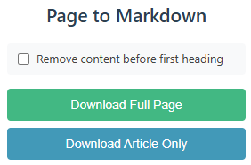
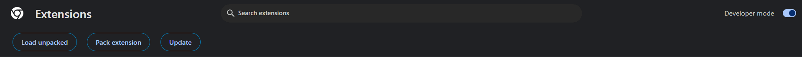

# Page To Markdown Extension

> A [Chrome extension](https://chromewebstore.google.com), that lets you export a page as markdown.

## Features

## Usage

1. Just clone the repository,
2. run `ni`
3. run `nr build`
4. and import it at "chrome://extensions" using "Load unpacked".

